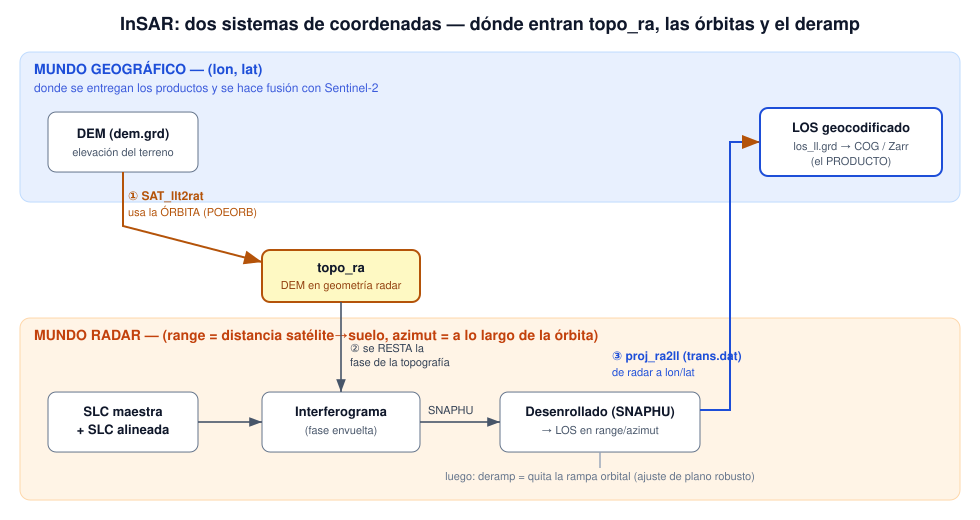

# Cookbook InSAR — GMTSAR + data science

Recetario reproducible para procesar pares **Sentinel‑1** con **GMTSAR** y dejar los
resultados listos para **análisis / data science** y para una futura **fusión con
Sentinel‑2**. Pensado para aprender: cada fase explica el *qué* y el *por qué*, entrega
productos, y avisa honestamente de sus límites.

> **Regla de oro del entorno:** correr **siempre** con `export LC_ALL=C`. El sistema está
> en locale `es_ES` (coma decimal) y sin esto GMTSAR rompe el parsing numérico (baseline
> NaN, coregistro `inf/nan`). Es la causa de fallos más traicionera del proyecto.

> **Nota sobre este repositorio:** en la máquina de trabajo los scripts de procesamiento viven
> en un árbol aparte (`proc/<exp>/`, fuera del cookbook, porque conviven con los SLC pesados).
> **En este repo van empaquetados junto al ejemplo**, en `examples/<exp>/` (`run.sh`, `unwrap.sh`,
> `deramp.sh`, `quicklook_*.py`, `config.s1a.txt`), para que sea autocontenido. Las rutas de la
> §3 que dicen `proc/<exp>/` corresponden al árbol local; en el repo, corré desde `examples/<exp>/`.

---

## 1. Filosofía: un entregable son **tres capas**, no una

| Capa | Formato | Para qué | Se abre en |
|------|---------|----------|------------|
| **Ver** | PNG + **KML/KMZ** | mirar, comunicar, ubicar en el mapa | Google Earth |
| **Analizar** | **GeoTIFF COG** (EPSG:4326) | data science, estadística, fusión | QGIS, Python (`rasterio`/`xarray`) |
| **Procedencia** | `run_metadata.json` | reproducibilidad, trazabilidad | cualquiera |

**Por qué importa:** el KML es una *imagen renderizada* — no tiene el valor por píxel. Para
hacer ciencia de datos necesitás el **GeoTIFF**, que lleva el número real (mm de LOS,
coherencia 0–1, radianes). Por eso cada fase exporta **las dos cosas**.

---

## 2. Las fases del pipeline

```
SLCs (SAFE) + órbitas POEORB
   │  ①  p2p_S1_TOPS_Frame.csh   (align + interferograma por subswath + merge)
   ▼
merge/  phasefilt.grd · corr.grd            ← fase envuelta + coherencia (coord. radar)
   │  ②  unwrap.sh  →  snaphu.csh           (desenrollado) + geocodificación
   ▼
merge/  phasefilt_ll · corr_ll · unwrap_ll · los_ll · *.kml  ← fase, coherencia y LOS (mm), lon/lat
   │  ③  deramp.sh  →  grdtrend -N3+r        (quitar rampa orbital)
   ▼
merge/  los_detrend_ll.grd                  ← LOS sin rampa (residual ≈ atmósfera)
   │  ④  lib/export_products.sh             (grd → COG + metadata)
   ▼
products/cog/*.tif + run_metadata.json      ← capa de ANÁLISIS
   │  ⑤  lib/datacube.py                    (apila en grilla común, dim `time`)
   ▼
products/datacube.zarr                      ← FUSION‑READY + SBAS‑READY (enchufar S2 aquí)
```

| Fase | Herramienta | Entregables |
|------|-------------|-------------|
| ① Align + intf + merge | `p2p_S1_TOPS_Frame.csh` | `phasefilt.grd`, `corr.grd` (radar) |
| ② Unwrap + geocode | `unwrap.sh` (`snaphu.csh`) | `phasefilt_ll`, `corr_ll`, `unwrap_ll`, `los_ll` (+ **KML**) |
| ③ Deramp | `deramp.sh` (`grdtrend -N3+r`) | `los_detrend_ll.grd`, `unwrap_detrend_ll.grd` |
| ④ Export | `lib/export_products.sh` | **COG** `*.tif` + `*.json` + `run_metadata.json` |
| ⑤ Datacube | `lib/datacube.py` | `datacube.zarr` (dim `time`, chunked; NetCDF opcional; + UTM) |

---

## 3. Cómo correr un experimento nuevo

**Dos árboles** (a propósito): los scripts de procesamiento y las salidas GMTSAR viven en
`proc/<exp>/` (fuera de `cookbook/`, porque son pesados); `cookbook/` guarda la librería
reutilizable (`lib/`), la doc y los productos del ejemplo. El ejemplo resuelto está en
`../proc/nicaragua_2018/` (scripts) y `examples/nicaragua_2018/` (productos).

1. **Datos.** Conseguí el par S1 SLC (IW, VV) y sus órbitas **POEORB** (precisas). La descarga
   la hacés vos (requiere credenciales ASF/Copernicus); usá `download_sentinel_orbits_linux.csh`
   para las órbitas en Linux (la genérica usa `date -v` de macOS y falla).
2. **Config.** `cp cookbook/config.template proc/<exp>/config.env`, editá fechas/rutas SAFE-EOF/`THRESH`,
   y **antes de cada paso** `source proc/<exp>/config.env` (así los scripts heredan los parámetros).
3. **Procesar** (fases ① a ③), en `proc/<exp>/`, todo con `LC_ALL=C`:
   ```bash
   source config.env
   bash run.sh        # ①  align + intf + merge  (p2p)
   bash unwrap.sh     # ②  snaphu + geocode (phasefilt, corr, unwrap, los) + KML
   bash deramp.sh     # ③  quita la rampa (plano robusto) -> los_detrend
   ```
4. **Exportar** (fase ④) — grd → COG + metadata:
   ```bash
   source proc/<exp>/config.env
   bash cookbook/lib/export_products.sh proc/<exp>/merge cookbook/examples/<exp>/products
   ```
5. **Datacube** (fase ⑤):
   ```bash
   "$PY" cookbook/lib/datacube.py cookbook/examples/<exp>/products                  # -> datacube.zarr (EPSG:4326)
   "$PY" cookbook/lib/datacube.py cookbook/examples/<exp>/products --utm            # + UTM (--epsg 32616)
   "$PY" cookbook/lib/datacube.py cookbook/examples/<exp>/products --format netcdf  # NetCDF en vez de Zarr
   ```

---

## 4. Preparado para fusión con Sentinel‑2

La fusión InSAR × óptico **no está ejecutada** — está *lista para enchufar*:

- **Grilla común.** Los COG están en `EPSG:4326`; `datacube.py` los alinea a una sola grilla.
  Para ML pixel‑a‑pixel conviene metros: `to_utm(ds, 32616)` (UTM 16N, la zona de los tiles
  S2 en Nicaragua).
- **El enchufe es `add_raster()`.** Resamplea *cualquier* raster (un NDVI de S2, o varias bandas) a
  la grilla exacta del cubo y lo agrega como variable (multibanda → `ndvi_b1`, `ndvi_b2`, …):
  ```python
  from datacube import build_cube, add_raster, to_utm, save, open_cube, append_time
  ds = build_cube("examples/nicaragua_2018/products")   # -> (time=1, y, x)
  ds = add_raster(ds, "ndvi_s2.tif", "ndvi")   # ← aquí entra Sentinel‑2 (1 o N bandas)
  save(to_utm(ds), "cubo_fusion.zarr")         # Zarr por defecto
  ds2 = open_cube("cubo_fusion.zarr")          # reabrir CON el CRS
  ```
  Ojo al reabrir un cubo: usá `open_cube()` (maneja Zarr y NetCDF con el CRS), no
  `xr.open_dataset` a secas o se pierde el CRS y `to_utm`/`add_raster` fallan.

- **Formato Zarr + dimensión `time` (para series temporales / SBAS).** El cubo se guarda por
  defecto en **Zarr** (chunked, comprimido, lazy) con una dim `time` (= fecha secundaria;
  `reference_time` = master). Cuando pases a **SBAS**, cada par nuevo se **apenda** al mismo store:
  ```python
  append_time("stack.zarr", build_cube("examples/otra_fecha/products"))  # suma una fecha
  ```
  (NetCDF sigue disponible con `save(ds, "cube.nc", fmt="netcdf")` para un par suelto.)
- **El vínculo físico natural: coherencia ↔ NDVI.** Donde hay vegetación (NDVI alto) el radar
  **pierde coherencia** entre pasadas. Ese es el primer experimento de fusión con sentido:
  correlacionar `coherence` (del cubo) con `ndvi` (de S2). También sirve para enmascarar/interpretar.

---

## 5. Dos sistemas de coordenadas — topo_ra, órbitas y deramp



El procesamiento se mueve entre **dos sistemas de coordenadas**, y conviene tenerlo claro:

- **Radar** (*range* = distancia satélite→suelo; *azimut* = a lo largo de la órbita): el sistema
  natural del dato. Ahí viven la SLC, el interferograma y el desenrollado.
- **Geográfico** (lon, lat): donde se entregan los productos (LOS, coherencia) para mirarlos y hacer
  ciencia de datos.

Tres conceptos que suelen costar, ubicados en ese flujo:

### topo_ra — el puente de geográfico a radar
El DEM (`dem.grd`) está en lon/lat, pero el interferograma vive en geometría radar. Para restar la
contribución de la **topografía** a la fase, hace falta la elevación *en la grilla del radar*.
`dem2topo_ra.csh` proyecta cada punto del DEM a (range, azimut) con `SAT_llt2rat` —que usa la órbita— y
lo resamplea con `gmt surface` → `topo_ra.grd`. Con eso GMTSAR calcula la fase topográfica esperada y la
resta (parámetro `topo_phase = 1`). La misma geometría (`trans.dat`) se reutiliza al final para
**geocodificar** (`proj_ra2ll`, de radar a lon/lat).

### Órbitas POEORB — dónde estaba el satélite
Para convertir fase en geometría, GMTSAR necesita la posición precisa del satélite en cada instante: la
**órbita**. Sentinel-1 publica archivos `.EOF` de precisión creciente:

- **RESORB** (restituida): lista pocas horas después de la toma; precisión moderada.
- **POEORB** (*Precise Orbit Ephemerides*, efemérides orbitales precisas): lista ~20 días después;
  precisión de centímetros — la mejor.

Órbitas imprecisas producen (a) errores de *baseline* → fase topográfica mal removida, y (b) una
**rampa** en el interferograma. Regla práctica: usar **POEORB** siempre que exista (≥20 días tras la
toma). En el ejemplo de Nicaragua una órbita RESORB rompió el cálculo de baseline; con POEORB funcionó.

### Deramp — quitar la rampa orbital
Después de desenrollar, el LOS todavía tiene un basculamiento suave de gran escala en toda la escena: la
**rampa**. Viene sobre todo de pequeños errores de órbita, que producen una fase casi lineal (un plano
inclinado). Como una rampa es, a primer orden, un plano `a·x + b·y + c`, se elimina **ajustando un plano
al LOS y restándolo**: `gmt grdtrend -N3+r` (`N3` = plano: constante + pendiente en x + pendiente en y;
`+r` = robusto, ignora valores extremos para que una señal localizada no sesgue el ajuste). Queda
`los_detrend`, con la señal de longitud de onda más corta (deformación localizada, si la hay, + atmósfera).

**Cuidado:** el ajuste quita *cualquier* gradiente lineal. Si la deformación real fuera de gran escala y
casi lineal, el deramp también la removería. Es seguro en AOIs chicas o cuando no se espera señal de gran
escala. En Grecia el deramp casi no cambió σ (13.8→13.7 mm): con POEORB no había rampa apreciable, y el
residual es atmósfera troposférica.

---

## 6. Glosario mínimo

- **SLC** — imagen radar compleja (amplitud + fase), sin proyectar.
- **Interferograma** — diferencia de fase entre dos SLC; codifica topografía + desplazamiento + atmósfera + ruido.
- **Coherencia** — calidad del interferograma (0–1). Baja = fase ruidosa (vegetación, agua, cambio).
- **Fase envuelta / desenrollada** — la fase medida vive en (−π, π] (*envuelta*); *desenrollar*
  (SNAPHU) reconstruye los ciclos enteros para tener una fase continua.
- **LOS** (Line‑Of‑Sight) — desplazamiento proyectado en la línea de visado del satélite. **No es
  vertical**: el radar mira de costado. `los_mm = fase · (−λ/4π) · 1000`.
- **Rampa** — gradiente suave de fase por error de órbita; se quita con un plano (`grdtrend`). Ver §5.
- **topo_ra** — el DEM reproyectado a la geometría radar (range/azimut); permite restar la fase de la topografía (§5).
- **Órbitas RESORB / POEORB** — archivos `.EOF` con la posición del satélite; POEORB (precisas, ~20 d después) son las mejores (§5).
- **Baseline temporal / perpendicular** — separación en tiempo / en posición entre las dos órbitas.
- **SBAS / stacking** — combinar **muchos** interferogramas para promediar la atmósfera y medir deformación.

---

## 7. Caveats honestos (leer antes de interpretar)

- **Un solo par ≠ mapa de deformación.** En un interferograma aislado la señal está dominada por
  **atmósfera troposférica** (ver el ejemplo: tras quitar la rampa quedan ~16 mm de σ que son
  atmósfera, no suelo moviéndose). Para deformación real hace falta **SBAS/stacking** (fase futura).
- **LOS no es desplazamiento vertical** — es una proyección oblicua. Ojo al fusionar con óptico (nadir).
  Convención GMTSAR: **LOS positivo = movimiento hacia el satélite** (disminución de rango).
- **El deramp puede borrar señal real.** El plano robusto (`deramp.sh`) elimina *cualquier* gradiente
  lineal. En un par quieto eso es órbita/atmósfera, pero en una zona con **deformación tectónica de
  gran longitud de onda** el plano se llevaría también esa señal. Usalo a conciencia.
- **Resolución distinta** — InSAR geocodificado ~46 m vs S2 10 m. Fusionar = **resamplear** (lo hace
  `add_raster`), documentándolo; no son la misma grilla nativa.
- **`snaphu_interp` vs `snaphu`** — con muchas NaN (baja coherencia), `snaphu_interp.csh` llama a
  `nearest_grid` (radio 300 px, 1 hilo) que **se cuelga horas**. Usar `snaphu.csh` normal salvo que
  sepas que la escena es muy coherente.

---

## 8. Ejemplo resuelto: `examples/nicaragua_2018/`

Par S1A **2018‑03‑17 / 03‑29** (12 días), arco volcánico de Nicaragua, 3 subswaths + merge.
Dataset oficial de prueba de GMTSAR. Productos en `products/` (6 COG + metadata + `datacube.zarr`).
Resultado: desenrollado limpio, sin deformación localizada (correcto para un par quieto); el residual
tras deramp es **mayormente atmósfera troposférica**. Valida el pipeline de punta a punta.
