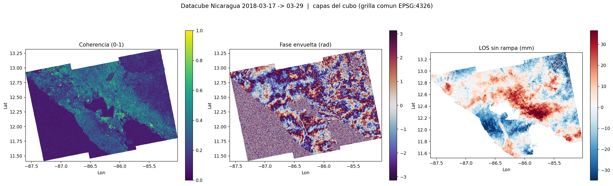

# InSAR Cookbook — GMTSAR + data science

A **reproducible recipe** for turning a pair of **Sentinel-1** radar images into an
**analysis-ready** interferometric product with [GMTSAR](https://github.com/gmtsar/gmtsar),
and for exporting that product in formats built for **data science** and a future
**fusion with Sentinel-2**.

It is written to be *learned from*: every phase explains **what** it does and **why**,
emits concrete deliverables, and states its limits honestly.

> 🇪🇸 A detailed, teaching-oriented guide in Spanish lives in **[README.es.md](README.es.md)**.



---

## What it does

Given two Sentinel-1 SLC acquisitions (same track, IW mode) and their precise orbits, the
cookbook runs the full interferometric chain and packages the result three different ways:

```
Sentinel-1 SLC pair (+ POEORB orbits)
        │
        │  ①  align + interferogram per sub-swath + merge   (GMTSAR p2p_S1_TOPS_Frame.csh)
        ▼
   wrapped phase + coherence  (radar coordinates)
        │  ②  phase unwrapping (SNAPHU) + geocoding          (unwrap.sh)
        ▼
   unwrapped phase, coherence, LOS displacement  (lon/lat, millimetres)
        │  ③  orbital-ramp removal (robust plane fit)        (deramp.sh)
        ▼
   LOS with the ramp removed  (residual ≈ tropospheric atmosphere)
        │  ④  export to analysis formats                     (lib/export_products.sh)
        ▼
   Cloud-Optimized GeoTIFFs + provenance metadata
        │  ⑤  stack onto a common grid                       (lib/datacube.py)
        ▼
   Zarr datacube  ·  fusion-ready + SBAS-ready
```

## One deliverable is **three layers**, not one

| Layer | Format | Purpose | Opens in |
|-------|--------|---------|----------|
| **View** | PNG + **KML/KMZ** | look at it, communicate, locate on a map | Google Earth |
| **Analyze** | **Cloud-Optimized GeoTIFF** (EPSG:4326) | statistics, data science, fusion | QGIS, Python (`rasterio` / `xarray`) |
| **Provenance** | `run_metadata.json` | reproducibility, traceability | anything |

**Why it matters:** a KML is a *rendered picture* — it has no per-pixel value. To do data
science you need the **GeoTIFF**, which carries the real number (millimetres of LOS,
coherence 0–1, radians). So every phase exports **both**.

The final **Zarr datacube** (`lib/datacube.py`) stacks LOS, coherence and phase onto one
common grid with a `time` dimension, ready to (a) **append more dates** for SBAS / time-series,
and (b) **plug in a Sentinel-2 raster** (e.g. NDVI) via a single `add_raster()` call. The
natural first fusion experiment is **coherence ↔ NDVI**: vegetation makes the radar lose
coherence between passes.

---

## Repository layout

```
cookbook/
├── README.md              ← you are here (English, overview)
├── README.es.md           ← detailed teaching guide (Spanish)
├── config.template        ← copy to config.env, edit, `source` it before running
├── lib/                   ← reusable, experiment-agnostic tools
│   ├── export_products.sh     grd → COG + sidecar/provenance JSON
│   └── datacube.py            stack COGs → xarray/Zarr cube (+ Sentinel-2 hook)
└── examples/
    ├── nicaragua_2018/    ← worked example #1 (S1A, 2018-03-17 / 03-29, volcanic arc)
    │   ├── run.sh             ① align + interferogram + merge
    │   ├── unwrap.sh          ② SNAPHU unwrap + geocode
    │   ├── deramp.sh          ③ remove the orbital ramp
    │   ├── config.s1a.txt     GMTSAR processing config for this pair
    │   ├── quicklook_*.py     quick PNG previews
    │   └── contact_sheet.png  showcase (other outputs are regenerated, not committed)
    └── greece_2015/       ← worked example #2 (S1A, 2015-11-05 / 2015-11-17, Gulf of Corinth)
        └── …                  same parametrized scripts, different config.env (see its README)
```

> The heavy generated outputs (COGs, the `datacube.zarr`, KML overlays) are **git-ignored** on
> purpose — they are reproducible artifacts, not source. Run the pipeline to regenerate them.

---

## Requirements

- **[GMTSAR](https://github.com/gmtsar/gmtsar) v6.x** and **GMT 6.x** on the `PATH`, plus SNAPHU.
- **Python** with `xarray`, `rioxarray`, `rasterio`, `zarr`, `numpy`, `matplotlib`
  (the scripts default to a conda env named `geoai`; override with the `PY` variable).
- **GDAL** (`gdal_translate`) for the COG export.
- **`LC_ALL=C`** — *critical*. On a comma-decimal locale (e.g. `es_ES`) GMTSAR's numeric
  parsing breaks (NaN baselines, `inf/nan` coregistration). Every script here exports it;
  keep it that way.

## Quickstart

```bash
# 0) one-time: copy and edit the config for your pair
cp config.template examples/<exp>/config.env
$EDITOR examples/<exp>/config.env          # SAFE paths, orbit (.EOF) paths, dates, thresholds

# 1) process (from examples/<exp>/), each step reading config.env
source config.env
bash run.sh          # ① align + interferogram + merge   (the long one)
bash unwrap.sh       # ② SNAPHU unwrap + geocode + KML
bash deramp.sh       # ③ remove the orbital ramp

# 2) export analysis-ready products
bash ../../lib/export_products.sh merge products     # → products/cog/*.tif + metadata
"$PY" ../../lib/datacube.py products                 # → products/datacube.zarr
"$PY" ../../lib/datacube.py products --utm           # + a UTM (metres) copy for pixel-wise ML
```

See **[README.es.md](README.es.md)** for the step-by-step walkthrough, a glossary, and the
reasoning behind each parameter.

---

## Honest caveats (read before interpreting results)

- **A single pair is not a deformation map.** In one isolated interferogram the signal is
  dominated by **tropospheric atmosphere**. For real ground motion you need **SBAS / stacking**
  (many interferograms) — which is exactly what the `time`-aware datacube is built for.
- **LOS is not vertical displacement.** It is the projection onto the radar's slanted
  line-of-sight. GMTSAR sign convention: **positive LOS = motion toward the satellite**
  (range decrease).
- **The deramp can erase real signal.** The robust plane fit removes *any* linear gradient. On
  a quiet pair that is orbit/atmosphere, but over long-wavelength tectonic deformation it would
  remove that too. Use it deliberately.
- **`snaphu` vs `snaphu_interp`.** With many NaNs (low coherence), `snaphu_interp.csh` calls
  `nearest_grid` (radius 300 px, single-threaded) which can **hang for hours**. The default here
  is plain `snaphu.csh`; only switch to interp for genuinely coherent scenes.

---

## Worked example: `examples/nicaragua_2018/`

Sentinel-1A pair **2018-03-17 / 03-29** (12 days) over the Nicaraguan volcanic arc, 3 sub-swaths
merged — GMTSAR's official S1 test scene. The unwrapping is clean and shows **no localized
deformation** (correct for a quiet pair); the post-deramp residual is **mostly tropospheric
atmosphere**. It validates the pipeline end-to-end.

A **second example**, [`examples/greece_2015/`](examples/greece_2015) (Gulf of Corinth, 2015),
runs the **same parametrized scripts** with only a different `config.env` — demonstrating the
"one recipe, many scenes" design, and exercising an eastern-hemisphere scene (see its README for
the longitude-wrap note and the single-core SNAPHU timing).

---

*Built as a study project for the 2026 InSAR Processing & Theory (GMTSAR) course. Contributions
and corrections welcome.*
