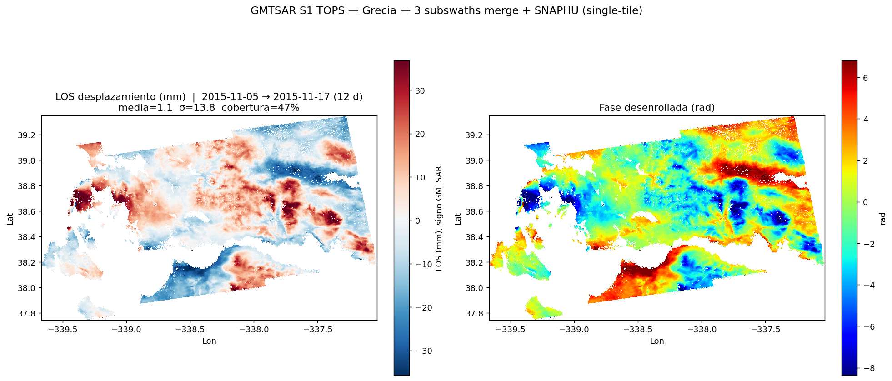

# Example: Greece 2015 (Gulf of Corinth)

Second worked example — **Sentinel-1A pair `2015-11-05 / 2015-11-17`** (12 days), the official
GMTSAR *S1A_SLC_TOPS_Greece* test scene, 3 sub-swaths merged. It covers the **Gulf of
Corinth / Gulf of Patras** region of western Greece (lon ≈ 20.3–23.0°E, lat ≈ 37.7–39.4°N).



## Why this example exists

It runs the **exact same parametrized scripts** as [`../nicaragua_2018/`](../nicaragua_2018) —
`run.sh`, `unwrap.sh`, `deramp.sh`, `quicklook_*.py` — with **only a different `config.env`** and
a different GMTSAR config (`config.txt`). That is the whole point of the cookbook: *one recipe,
many scenes*. Testing on this second dataset is what shaved the last hard-coded assumptions out
of the scripts (the config filename, the parallel flag, the plot labels).

## How to run

```bash
source config.env                 # sets the SAFE/orbit names, dates, CONFIG=config.txt, PARALLEL=1, AOI_DESC=Grecia
bash run.sh                       # ① align + interferogram ×3 + merge  (POEORB orbits + DEM are bundled in the tarball)
bash unwrap.sh                    # ② SNAPHU unwrap + geocode + KML
bash deramp.sh                    # ③ remove the (here negligible) orbital ramp
bash ../../lib/export_products.sh merge products      # ④ COGs + metadata
"$PY" ../../lib/datacube.py products                  # ⑤ datacube.zarr (EPSG:4326)
"$PY" ../../lib/datacube.py products --utm            #    datacube_utm.zarr (EPSG:32634, UTM 34N)
```

> `config.env` is normally git-ignored (it is your local, editable copy of `config.template`).
> This one is committed on purpose, `git add -f`, as the reference recipe for the example.

## Result (a healthy, quiet pair)

- **Clean unwrapping**, no localized deformation — correct for a 12-day quiet pair.
- LOS: **mean ≈ 1 mm, σ ≈ 14 mm**, coverage ≈ 38 % (the Gulfs are masked as water).
- **Deramp barely changes σ (13.8 → 13.7 mm)** → with precise POEORB orbits the orbital ramp is
  negligible; the residual is **elevation-correlated tropospheric atmosphere**, not ground motion.

## Two things worth knowing (they are good talking points)

1. **Unwrapping is the bottleneck.** SNAPHU ran ~1.5 h on a **single core** (58 M pixels, single
   tile). GMTSAR's heavy algorithms are not multi-threaded — parallelism here is at the
   *sub-swath* and *batch* level, not inside snaphu. (See the main README.)
2. **Eastern-hemisphere longitude wrap.** GMTSAR geocodes this scene with longitude in a wrapped
   form (**−339.7…−337.0°**, i.e. `lon − 360`). It is a valid but non-standard label. The **UTM
   cube (`datacube_utm.zarr`) is already correct** and is the right choice for Sentinel-2 fusion.
   To normalize the EPSG:4326 grids to standard `+20.3…+23.0°E`:
   ```bash
   gmt grdedit file_ll.grd -R<lonmin+360>/<lonmax+360>/<latmin>/<latmax>
   ```
